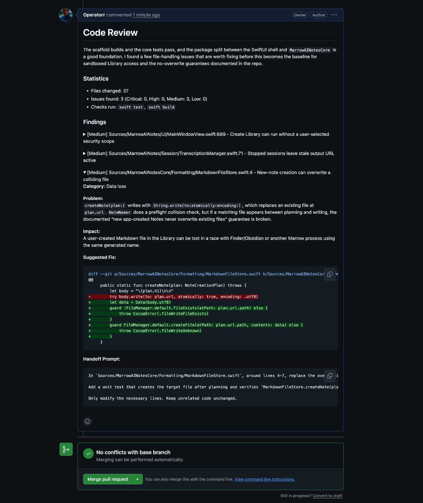

<p>
  
</p>

# AI Skills for Real Engineers

[](https://skills.sh/Operatorr/skills)

A personal collection of small, composable agent skills I use for real engineering work.

## Quickstart

Install from this public GitHub repo with the Skills CLI:

```bash
npx skills@latest add Operatorr/skills
```

Then pick the skills you want to install into your coding agent.

> This does **not** require publishing this repo to npm. The `skills` npm package is the installer; `Operatorr/skills` points it at this GitHub repository.

## Structure

```text
.
├── .claude-plugin/        # optional plugin/config files if needed later
├── .out-of-scope/         # deprecated or parked skills/docs
├── docs/adr/              # architecture decision records
├── scripts/               # repo maintenance scripts
├── skills/
│   ├── engineering/       # code and engineering workflow skills
│   │   ├── code-review/
│   │   │   ├── SKILL.md
│   │   │   ├── REFERENCE.md
│   │   │   └── PROJECT_REVIEW_TEMPLATE.md
│   │   ├── deep-review/
│   │   │   ├── SKILL.md
│   │   │   ├── REFERENCE.md
│   │   │   ├── SUBAGENT_PROMPT.md
│   │   │   └── TOOL_BATTERY.md
│   │   ├── git-commit/
│   │   │   └── SKILL.md
│   │   └── git-pr/
│   │       └── SKILL.md
│   ├── productivity/      # general workflow skills
│   │   └── rewrite/
│   │       └── SKILL.md
│   ├── security/          # authorized security assessments
│   │   └── penetration-testing/
│   │       ├── SKILL.md
│   │       └── references/
│   └── misc/              # occasional-use skills
├── CLAUDE.md              # optional agent instructions for this repo
├── CONTEXT.md             # shared vocabulary / repo context
└── README.md
```

Each skill should be self-contained and live at:

```text
skills/<category>/<skill-name>/SKILL.md
```

## Skills

### Engineering

- **[code-review](./skills/engineering/code-review/SKILL.md)** — fast, light reviews for GitHub PRs and local branch changes, usually surfacing only the top 1-3 material issues. Built for when you want quick senior-engineer signal without exhaustive CodeRabbit-style coverage.
- **[deep-review](./skills/engineering/deep-review/SKILL.md)** — the high-recall counterpart to code-review: a maximally thorough, CodeRabbit-style review that fans out one sub-agent per changed file, runs every available linter/SAST/secret scanner, and reports every issue down to nitpicks. Optimizes for coverage over signal-to-noise — closes most of the gap with CodeRabbit when you want to find everything.
- **[git-commit](./skills/engineering/git-commit/SKILL.md)** — stage all changes and create a git commit with an auto-generated, convention-matched message.
- **[git-pr](./skills/engineering/git-pr/SKILL.md)** — branch off master/develop when needed, commit all changes, push, and open a PR automatically.

### Productivity

- **[rewrite](./skills/productivity/rewrite/SKILL.md)** — rewrite or generate copy in a plain, human voice that avoids AI tells: inflated significance, stock vocabulary, trailing "-ing" why-it-matters clauses, "not just X but Y" parallelism, autopilot rule-of-three, and chatbot filler.

### Security

- **[penetration-testing](./skills/security/penetration-testing/SKILL.md)** — authorized security assessments of owned infrastructure (traditional hosts and managed/serverless/BaaS), gated on written scope, validated non-destructively, producing an OWASP/CWE/CVSS-mapped remediation report.

### Misc

None yet.

## Maintenance

List skills locally:

```bash
./scripts/list-skills
```

## Adding a skill

1. Create a directory at `skills/<category>/<skill-name>/`. Categories are `engineering`, `productivity`, `security`, and `misc`.
2. Add `SKILL.md` with the skill instructions.
3. Add any supporting examples, scripts, or reference docs inside the same skill directory.
4. Update the reference list in this README, the category `README.md` under `skills/<category>/`, and the path in `.claude-plugin/plugin.json`.

## Demo


